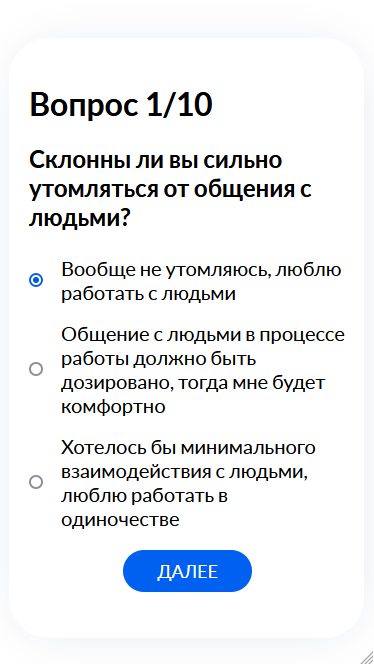

# Психологический тест для определения направления профессии

Пользователь проходит тест, в зависимости от его ответов, каждой профессии будут даваться баллы.
После прохождения теста выдается список профессий, которые больше всего подходят человеку (отсортированы по кол-ву баллов).

\* Данный проект был создан лишь для портфолио и не является достоверной рекомендацией выбора профессии. 

## О проекте

Проект состоит из нескольких страниц.
А именно:
- Страница приветствия
- Страница с самим тестом
- Страница с результатами

### API

Использовал Fake api [mockapi.io](https://mockapi.io/)

В нем я просто создал массив объектов, который он будет выдавать при запросе.

### Страница приветствия

Страница с приветствием и основной информацией о проекте.

Компьютер:

Телефон:

### Страница с самим тестом

Вопросов всего 10, может быть и больше, нужно просто добавить их в API.

Компьютер:

Телефон:

### Страница с результатами

Результаты прохождения теста с дополнительной информацией о профессии

Компьютер:

Телефон:
